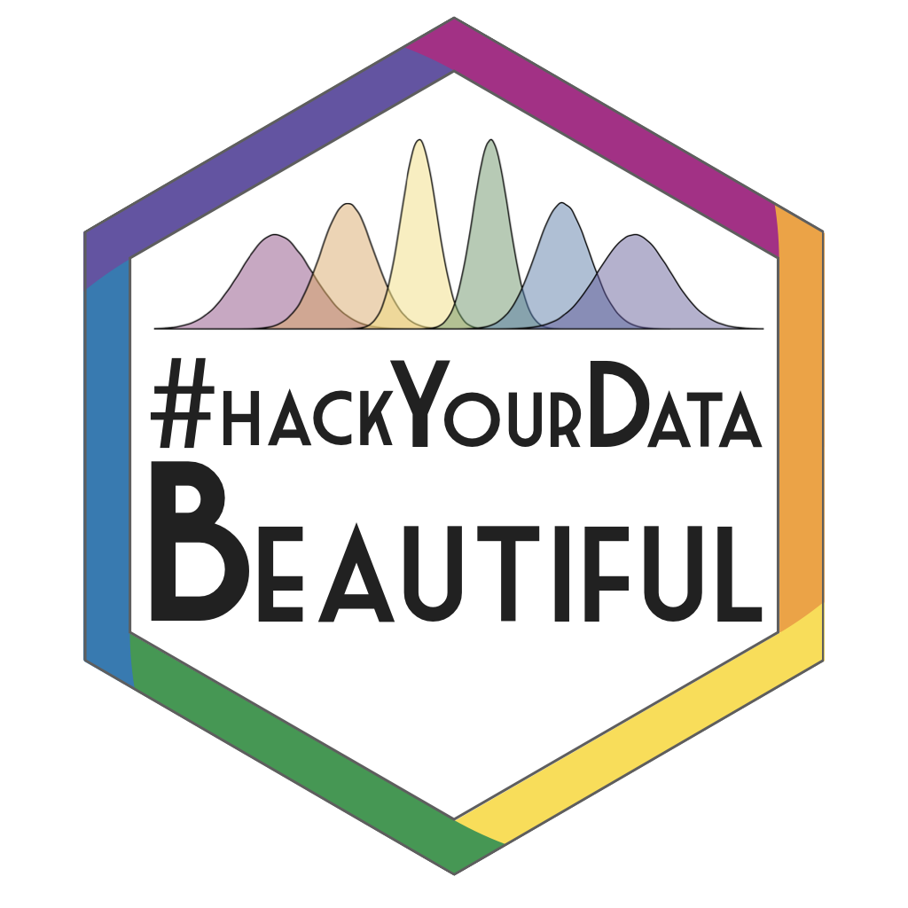

# misc

 

## Resource files

* [PsyTeachR logo](psyteachr_logo.key)
* Hex Templates: [Keynote](psyteachr_hex.key) / [PowerPoint](psyteachr_hex.pptx)
* [Warhol code](https://psyteachr.github.io/trdair_workshop/logo.html)
* [Market Deco font](https://www.dafont.com/market-deco.font)
